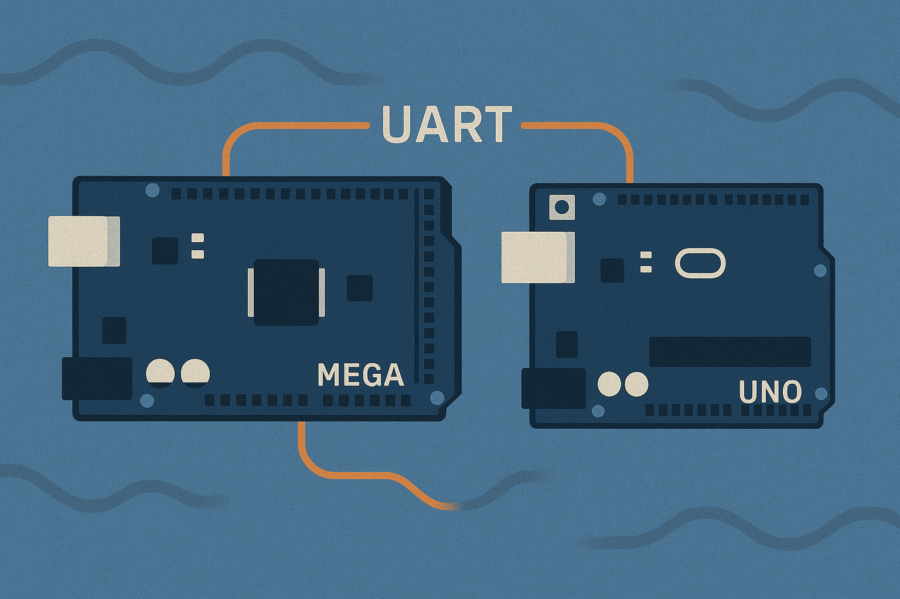
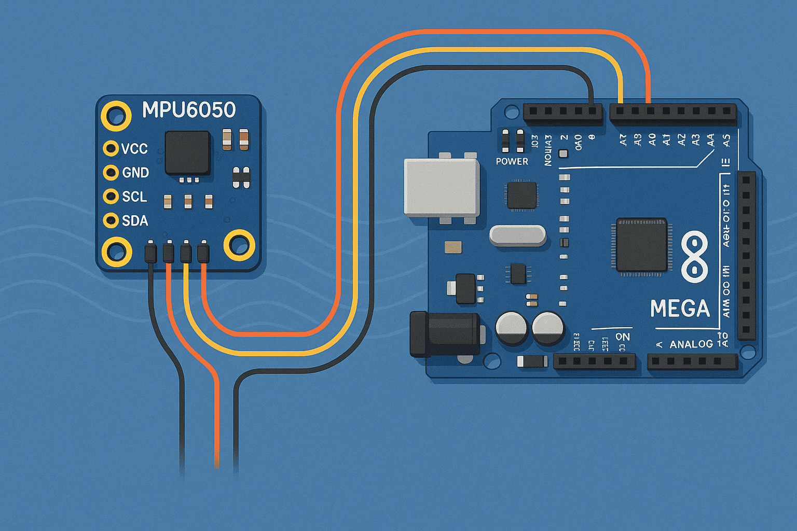

# Communication

In this gimbal project, communication between components plays a crucial role in ensuring precise and synchronized motion control. The I2C protocol is used to interface with the MPU6050 IMU, enabling real-time acquisition of orientation data (roll and pitch). SPI communication is employed for high-speed and reliable data transfer with the AS5048A encoders, which could in the future provide accurate angular position feedback for the brushless motors. Additionally, UART is used to share data between two Arduino boards, allowing coordination between pitch and roll axes. This combination of protocols ensures efficient sensor integration and smooth closed-loop control throughout the system.

    

        <a href="UART">
        
        
UART
</a>
    

    

        <a href="I2C">
        
        
I2C
</a>
    

