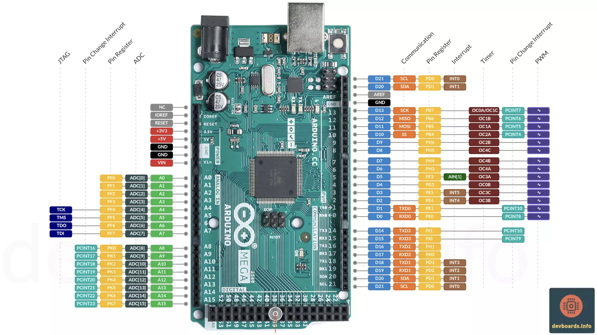

# Arduino MEGA 2560

- Arduino MEGA 2560 got selected due to the number of PWM pins available in addition to SPI and I2C that are required by the sensors and actuators.

## Arduino MEGA 2560 wiring scheme:

[Arduino MEGA 2560 detailed specs](https://devboards.info/boards/arduino-mega2560-rev3)

### General connections
| Sensor / Actuactor | Pin | Description | Arduino MEGA 2560 pin |
| ------------------ | --- | ----------- | --------------------- |
| MPU6050            | SDA | SDA         | D20 (SDA)             |
| MPU6050            | SCL | SCL         | D21 (SCL)             |
| MPU6050            | Vcc | Vcc         | 3V3                   |
| MPU6050            | GND | GND         | GND                   |

### Motor 1 PITCH
| Sensor / Actuactor    | Pin    | Description   | Arduino MEGA 2560 pin |
| --------------------- | ------ | ------------- | --------------------- |
| SimpleFOC mini driver | EN     | EN            | D8 (PWM)              |
| SimpleFOC mini driver | IN1    | Motor Phase 1 | D2 (PWM)              |
| SimpleFOC mini driver | IN2    | Motor Phase 2 | D3 (PWM)              |
| SimpleFOC mini driver | IN3    | Motor Phase 3 | D4 (PWM)              |
| SimpleFOC mini driver | GND    | GND           | GND                   |
| AS5408A Encoder       | red    | CLK           | D52 (CLK)             |
| AS5408A Encoder       | yellow | MISO          | D50 (MISO)            |
| AS5408A Encoder       | black  | MOSI          | D51 (MOSI)            |
| AS5408A Encoder       | white  | CSN/SS        | D12                   |
| AS5408A Encoder       | green  | 5V            | 5V                    |
| AS5408A Encoder       | purple | GND           | GND                   |

### Motor 2 ROLL
| Sensor / Actuactor    | Pin    | Description   | Arduino MEGA 2560 pin |
| --------------------- | ------ | ------------- | --------------------- |
| SimpleFOC mini driver | EN     | EN            | D9 (PWM)              |
| SimpleFOC mini driver | IN1    | Motor Phase 1 | D5 (PWM)              |
| SimpleFOC mini driver | IN2    | Motor Phase 2 | D6 (PWM)              |
| SimpleFOC mini driver | IN3    | Motor Phase 3 | D7 (PWM)              |
| SimpleFOC mini driver | GND    | GND           | GND                   |
| AS5408A Encoder       | red    | CLK           | D52 (CLK)             |
| AS5408A Encoder       | yellow | MISO          | D50 (MISO)            |
| AS5408A Encoder       | black  | MOSI          | D51 (MOSI)            |
| AS5408A Encoder       | white  | CSN/SS        | D13                   |
| AS5408A Encoder       | green  | 5V            | 5V                    |
| AS5408A Encoder       | purple | GND           | GND                   |
