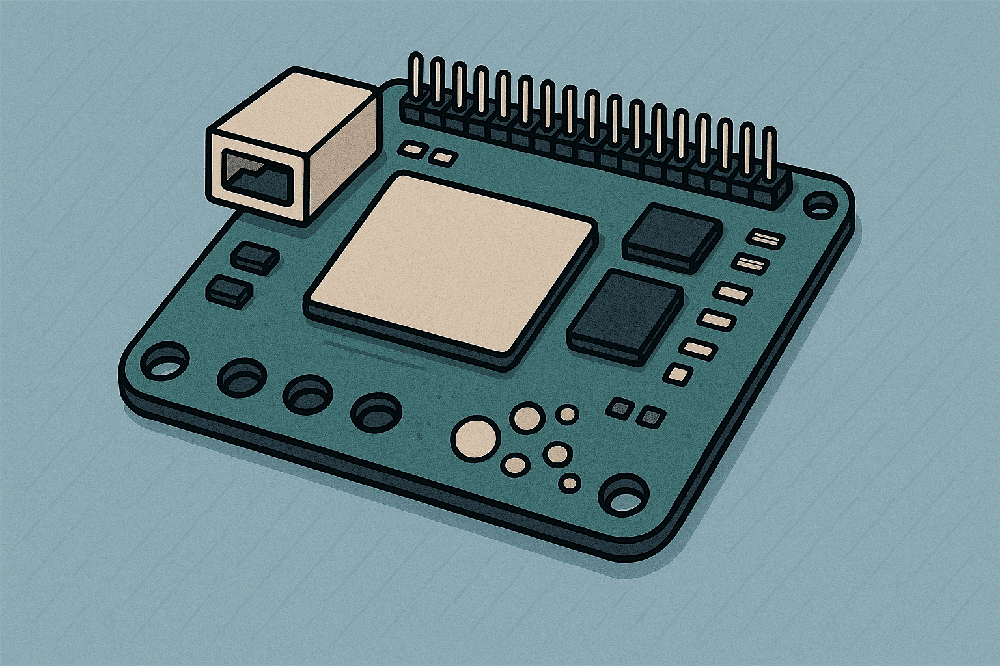
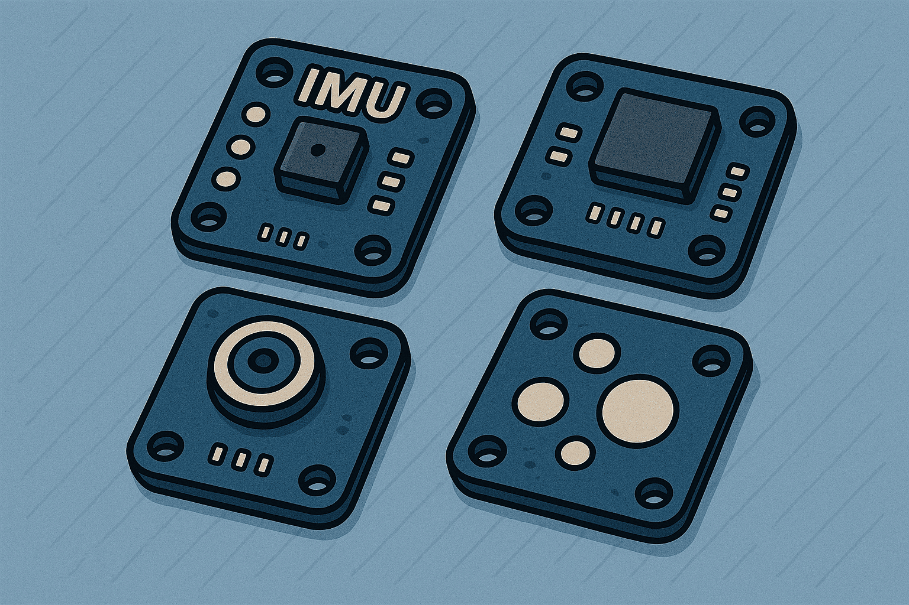
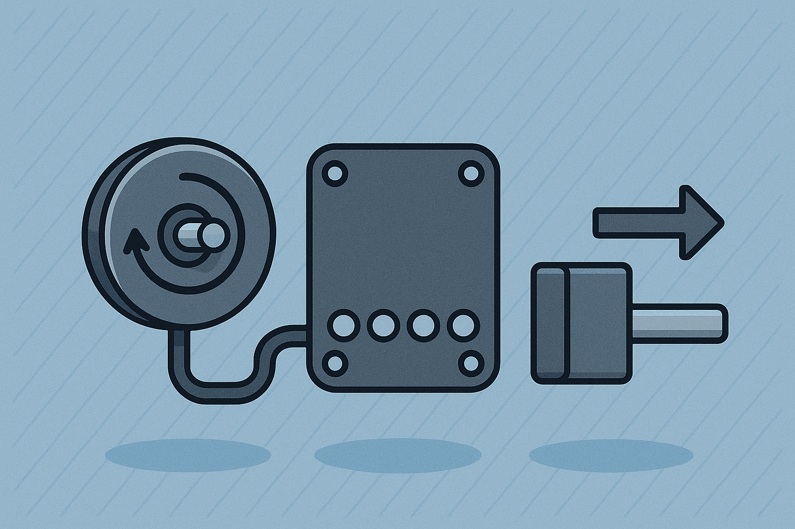

# Electronics 

This section outlines the electronic foundation of the gimbal system, including the sensors, motor drivers, and control hardware that enable precise and responsive motion. Each component plays a critical role in ensuring reliable performance and integration across the entire system.

    

        <a href="Boards">
        
        
Boards
</a>
    

    

        <a href="Sensors">
        
        
Sensors
</a>
    

        

        <a href="Actuators">
        
        
Actuators
</a>
    

