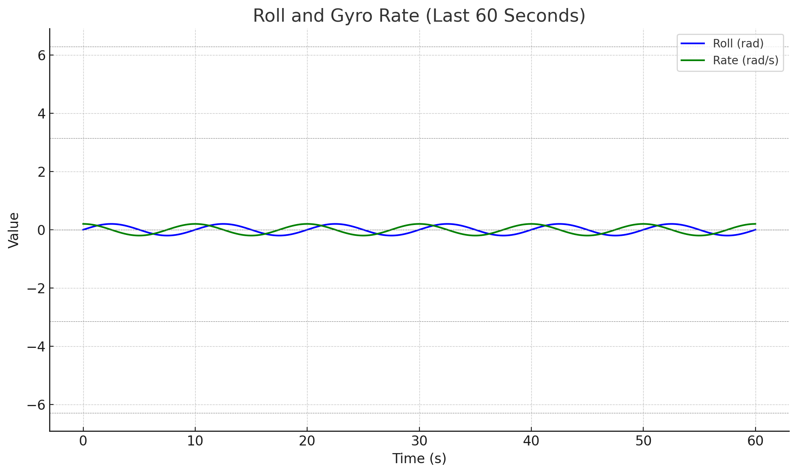

# MPU6050 IMU

- To approach the gyro project with greater confidence and reliability, it was essential to first gain hands-on experience with the MPU6050 sensor. This involved learning how to read raw accelerometer and gyroscope data, understanding sensor orientation, and implementing basic filtering techniques to extract stable pitch and roll angles. Mastering these fundamentals helped ensure that the sensor readings used for control logic would be accurate, consistent, and well-suited for integration into the gimbal system.
- We chose to implement a complementary filter and a simple low-pass filter to process the MPU6050 sensor readings, despite the availability of more advanced techniques like the Kalman filter. This decision was primarily due to time constraints, as these simpler methods provided a reliable and quick way to achieve stable angle estimation for our current needs. However, we recognize that incorporating a Kalman filter could significantly enhance the accuracy and robustness of the system, and we plan to explore and implement it in the near future as part of our ongoing improvements.

## 1. MPU6050 pitch and roll angles config and read - Only Complementary filter applied

```cpp
#include <Arduino.h>
#include <Wire.h>
#include <MPU6050.h>

MPU6050 mpu;

// Complementary filter constant
const float alpha = 0.96;

// Filtered angles
float pitch = 0.0;
float roll  = 0.0;

// Gyroscope bias
float gyroBiasX = 0.0;
float gyroBiasY = 0.0;

// Timing
unsigned long lastTime = 0;

// Function declarations
void calibrateGyroBias(int samples = 500);
void readRawData(int16_t &ax, int16_t &ay, int16_t &az, int16_t &gx, int16_t &gy, int16_t &gz);
void computeAngles(float dt, int16_t ax, int16_t ay, int16_t az, int16_t gx, int16_t gy);
void printDebug(int16_t ax, int16_t ay, int16_t az, int16_t gx, int16_t gy, int16_t gz, float dt);

void setup() {
    Serial.begin(115200);
    Wire.begin();
    mpu.initialize();

    if (!mpu.testConnection()) {
        Serial.println("MPU6050 connection failed!");
        while (1);
    }

    Serial.println("MPU6050 initialized. Stabilizing...");
    delay(1000);

    calibrateGyroBias();
    lastTime = micros(); // Use micros() for higher resolution
}

void loop() {
    int16_t ax, ay, az, gx, gy, gz;

    readRawData(ax, ay, az, gx, gy, gz);

    unsigned long currentTime = micros();
    float dt = (currentTime - lastTime) / 1e6;
    lastTime = currentTime;

    computeAngles(dt, ax, ay, az, gx, gy);
    printDebug(ax, ay, az, gx, gy, gz, dt);

    delay(100); // Slow down serial output for readability
}

void calibrateGyroBias(int samples) {
    long sumX = 0, sumY = 0;
    Serial.println("Calibrating gyro bias... Keep MPU6050 still.");

    for (int i = 0; i < samples; i++) {
        sumX += mpu.getRotationX();
        sumY += mpu.getRotationY();
        delay(2);
    }

    gyroBiasX = -sumX / (float)samples;
    gyroBiasY = -sumY / (float)samples;

    Serial.print("Gyro bias X: "); Serial.println(gyroBiasX);
    Serial.print("Gyro bias Y: "); Serial.println(gyroBiasY);
}

void readRawData(int16_t &ax, int16_t &ay, int16_t &az, int16_t &gx, int16_t &gy, int16_t &gz) {
    ax = mpu.getAccelerationX();
    ay = mpu.getAccelerationY();
    az = mpu.getAccelerationZ();
    gx = mpu.getRotationX();
    gy = mpu.getRotationY();
    gz = mpu.getRotationZ();
}

void computeAngles(float dt, int16_t ax, int16_t ay, int16_t az, int16_t gx, int16_t gy) {
    // Convert to float
    float axf = ax;
    float ayf = ay;
    float azf = az;

    // Accelerometer angle estimates (radians)
    float accelRoll  = atan2(ayf, azf);
    float accelPitch = atan2(-axf, sqrt(ayf * ayf + azf * azf));

    // Gyroscope rate in rad/s (bias corrected)
    float gyroRollRate  = (gx + gyroBiasX) / 131.0 * DEG_TO_RAD;
    float gyroPitchRate = (gy + gyroBiasY) / 131.0 * DEG_TO_RAD;

    // Complementary filter
    roll  = alpha * (roll  + gyroRollRate * dt)  + (1 - alpha) * accelRoll;
    pitch = alpha * (pitch + gyroPitchRate * dt) + (1 - alpha) * accelPitch;
}

void printDebug(int16_t ax, int16_t ay, int16_t az, int16_t gx, int16_t gy, int16_t gz, float dt) {
    Serial.println("===== DEBUG =====");

    Serial.print("Raw Accel [X,Y,Z] = ");
    Serial.print(ax); Serial.print(", ");
    Serial.print(ay); Serial.print(", ");
    Serial.println(az);

    Serial.print("Raw Gyro [X,Y,Z] = ");
    Serial.print(gx); Serial.print(", ");
    Serial.print(gy); Serial.print(", ");
    Serial.println(gz);

    Serial.print("Δt (s): ");
    Serial.println(dt, 4);

    Serial.print("Filtered Pitch: ");
    Serial.print(pitch, 3);
    Serial.print(" rad (");
    Serial.print(pitch * RAD_TO_DEG, 1);
    Serial.println(" deg)");

    Serial.print("Filtered Roll: ");
    Serial.print(roll, 3);
    Serial.print(" rad (");
    Serial.print(roll * RAD_TO_DEG, 1);
    Serial.println(" deg)");

    Serial.println();
}

```

## 2. MPU6050 pitch and roll angles config and read - Complementary and Low Pass filter applied

```cpp
#include <Arduino.h>
#include <MPU6050.h>
#include <SimpleFOC.h>
#include <Wire.h>
#include <math.h>

////////////////////////////////////////////
// ---------- IMU Configuration ---------- //
////////////////////////////////////////////
MPU6050 mpu;

float       gyroBiasX = 0.0, gyroBiasY = 0.0;
float       roll         = 0.0;
float       pitch        = 0.0;
float       gyroRollRate = 0.0, gyroPitchRate = 0.0;
float       prevPitchRate  = 0.0;
const float alpha          = 0.98;
const float GYRO_SCALE     = 131.0;
const float GYRO_LPF_ALPHA = 0.95;

////////////////////////////////////////////
// --------- Timing Variables ------------ //
////////////////////////////////////////////
unsigned long lastTime = 0, currentTime = 0;
float         dt           = 0.0;

////////////////////////////////////////////
// ----------- Debugging Vars ----------- //
////////////////////////////////////////////
int debugger_index = 0;

void Initialize_IMU()
{
    Wire.begin();
    mpu.initialize();

    if (!mpu.testConnection())
    {
        Serial.println("MPU6050 connection failed!");
        while (1)
            ;
    }

    Serial.println("MPU6050 initialized.");
    delay(1000);
}

void Gyro_Bias_Calibration(int samples = 360)
{
    long gxSum = 0, gySum = 0;

    Serial.println("Calibrating gyroscope... Keep the sensor still.");

    for (int i = 0; i < samples; i++)
    {
        gxSum += mpu.getRotationX();
        gySum += mpu.getRotationY();
        delay(2);
    }

    gyroBiasX = gxSum / (float)samples;
    gyroBiasY = gySum / (float)samples;

    Serial.print("Gyro bias X: ");
    Serial.println(gyroBiasX);
    Serial.print("Gyro bias Y: ");
    Serial.println(gyroBiasY);

    lastTime = millis(); // Initialize timer
}

////////////////////////////////////////////
// ---------- Sensor Processing ---------- //
////////////////////////////////////////////
void Pitch_And_Roll_Calculation()
{
    // Read raw data
    int16_t ax = mpu.getAccelerationX();
    int16_t ay = mpu.getAccelerationY();
    int16_t az = mpu.getAccelerationZ();
    int16_t gx = mpu.getRotationX();
    int16_t gy = mpu.getRotationY();

    // Time delta in seconds
    currentTime = millis();
    dt          = (float)(currentTime - lastTime) / 1000.0f;
    if (dt <= 0.0)
        dt = 0.001;
    lastTime = currentTime;

    // Convert accelerometer to float
    float axf = (float)ax;
    float ayf = (float)ay;
    float azf = (float)az;

    // Accel-derived angles
    float accelRoll  = atan2(ayf, azf);                          // around X
    float accelPitch = atan2(-axf, sqrt(ayf * ayf + azf * azf)); // around Y

    // --- Filter time check ---
    if (dt < 0.001f)
        dt = 0.001f;
    if (dt > 0.05f)
        dt = 0.05f;

    // --- Raw gyro conversion ---
    float rawGyroRoll  = (gx - gyroBiasX) / GYRO_SCALE * DEG_TO_RAD;
    float rawGyroPitch = (gy - gyroBiasY) / GYRO_SCALE * DEG_TO_RAD;

    // --- LPF smoothing ---
    gyroRollRate  = GYRO_LPF_ALPHA * gyroRollRate + (1 - GYRO_LPF_ALPHA) * rawGyroRoll;
    gyroPitchRate = GYRO_LPF_ALPHA * gyroPitchRate + (1 - GYRO_LPF_ALPHA) * rawGyroPitch;

    // --- Complementary filter ---
    roll  = alpha * (roll + gyroRollRate * dt) + (1 - alpha) * accelRoll;
    pitch = alpha * (pitch + gyroPitchRate * dt) + (1 - alpha) * accelPitch;
}

////////////////////////////////////////////
// ------------- Debug Output ------------ //
////////////////////////////////////////////
void Debbuging_Print()
{
    debugger_index++;
    if (debugger_index == 1)
    {
        Serial.print(millis());
        Serial.print(",");
        Serial.print(roll, 4);
        Serial.print(",");
        Serial.print(gyroRollRate, 4);
        Serial.print(",");
        Serial.print(pitch, 4);
        Serial.print(",");
        Serial.println(gyroPitchRate, 4); // End of line
        debugger_index = 0;
    }
}

void setup()
{
    Serial.begin(115200);
    delay(1000);
    Initialize_IMU();
    Gyro_Bias_Calibration();
}

void loop()
{
    Pitch_And_Roll_Calculation();
    Debbuging_Print();
}
```

## 3. Python script for displaying roll and pitch plots

- To fine-tune the performance of the low-pass and complementary filters, plotting the filtered versus raw data is essential, as it helps visualize the impact of different αα values on responsiveness and noise reduction.

```python
import serial
import matplotlib.pyplot as plt
import matplotlib.animation as animation
from collections import deque
import time
import math

# === CONFIG ===
PORT = '/dev/ttyUSB0'  # Change to your Arduino port
BAUD = 115200
WINDOW_SECONDS = 60
MAX_SAMPLES = 6000  # Approx. 100Hz × 60s

# === Data Buffers ===
time_vals = deque(maxlen=MAX_SAMPLES)
roll_vals = deque(maxlen=MAX_SAMPLES)
rate_vals = deque(maxlen=MAX_SAMPLES)

# === Setup Serial and Plot ===
ser = serial.Serial(PORT, BAUD)
time.sleep(2)

fig, ax = plt.subplots()
line_roll, = ax.plot([], [], label='Roll (rad)', color='blue')
line_rate, = ax.plot([], [], label='Rate (rad/s)', color='green')
ax.legend()
ax.set_xlabel('Time (s)')
ax.set_ylabel('Value')
ax.set_title('Roll and Gyro Rate (Last 60 Seconds)')
ax.grid(True, which='both', linestyle='--', linewidth=0.5, alpha=0.7)

# Reference lines for -π, 0, π
for y in [-2*math.pi, -math.pi, 0, math.pi, 2*math.pi]:
    ax.axhline(y=y, color='gray', linestyle='--', linewidth=0.4)

start_time = None

def update(frame):
    global start_time

    while ser.in_waiting:
        try:
            line = ser.readline().decode().strip()
            t_raw, roll, rate = map(float, line.split(","))

            if start_time is None:
                start_time = t_raw

            t = (t_raw - start_time) / 1000.0  # Convert ms → seconds

            time_vals.append(t)
            roll_vals.append(roll)
            rate_vals.append(rate)

        except:
            pass  # skip malformed line

    if len(time_vals) > 1:
        line_roll.set_data(time_vals, roll_vals)
        line_rate.set_data(time_vals, rate_vals)

        ax.set_xlim(max(0, time_vals[-1] - WINDOW_SECONDS), time_vals[-1])
        ax.set_ylim(-2 * math.pi, 2 * math.pi)

    return line_roll, line_rate

ani = animation.FuncAnimation(fig, update, interval=50)
plt.tight_layout()
plt.show()
```

- For exemple:

