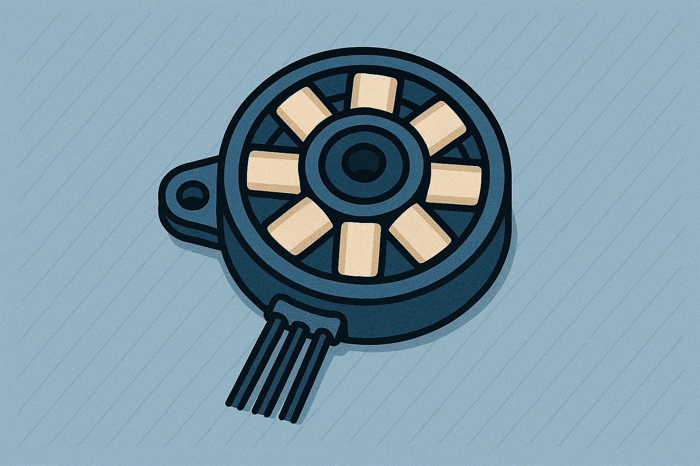
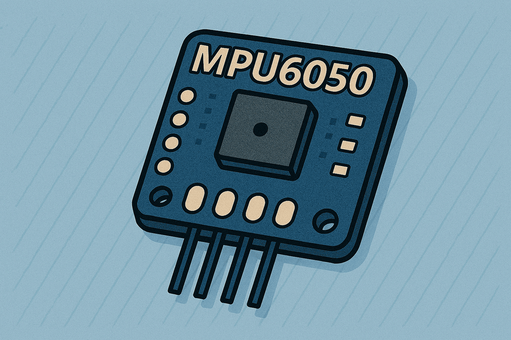
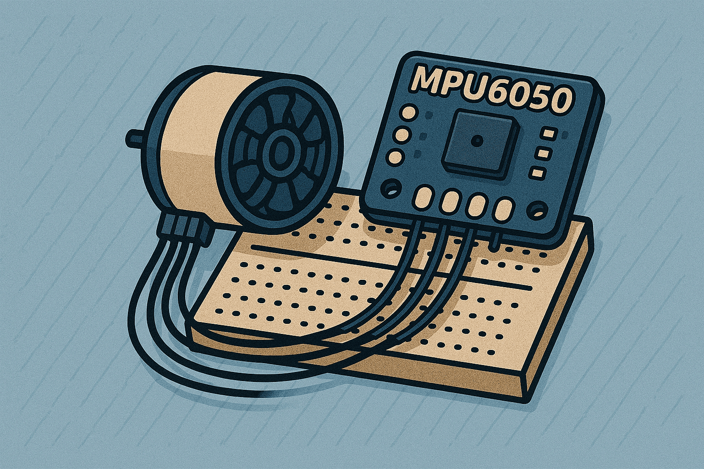
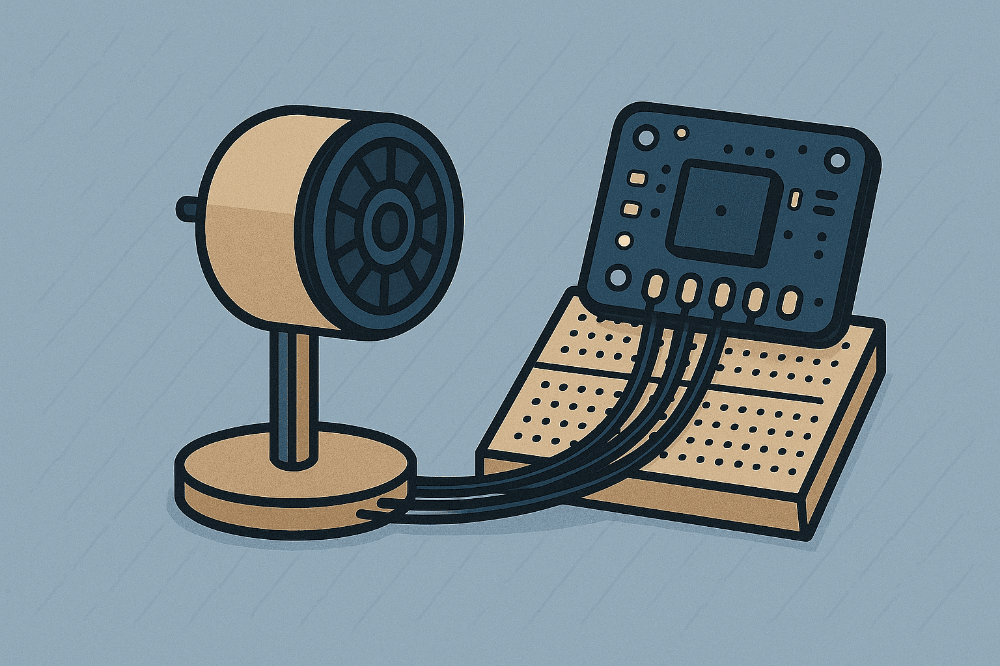
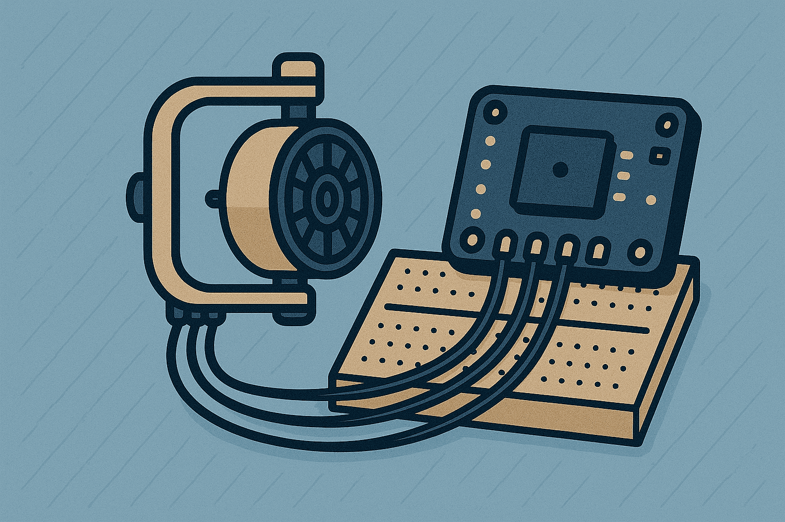

# Firmware

This section presents the firmware development process in a step-by-step format. It begins with basic motor control (Step 1) and MPU6050 sensor readings (Step 2), followed by an initial integration test combining a single motor with the MPU6050 (Step 3). From there, it progresses to a working one-axis (pitch) gyro system (Step 4), and finally to a full two-axis setup with pitch and roll stabilization (Step 5). Each step includes the relevant code and explanations to support learning and implementation.

    

        <a href="Motors">
        
        
1. Motors
</a>
    

    

        <a href="MPU6050">
        
        
2. MPU6050
</a>
    

        

        <a href="motor+mpu6050+encoder">
        
        
3. Single Motor + MPU Attempts
</a>
    

        

        <a href="oneaxis_gyro">
        
        
4. One Axis Gyro (Pitch only)
</a>
    

        

        <a href="twoaxis_gyro">
        
        
5. Two Axis Gyro (Pitch and Roll)
</a>
    

