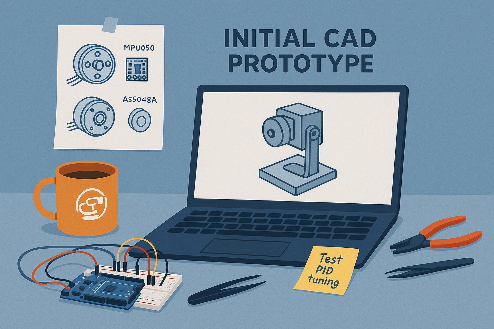
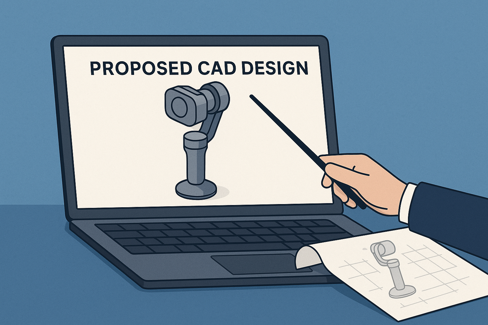

# Mechanical Design

    

        <a href="development_preliminary_design" >
        
        
1. Development Preliminary Design
</a>
    

    

        <a href="preliminary_proposed_design">
        
        
2. Preliminary Proposed Design
</a>
    

