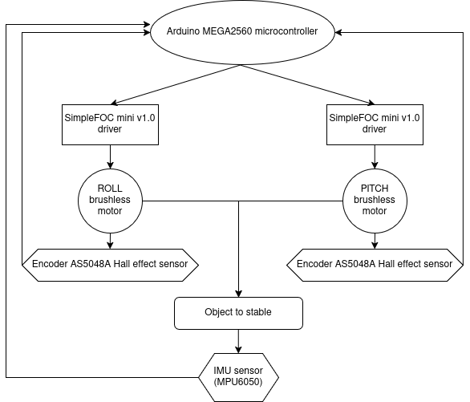

# Overview

## Introduction

The perpuse of this projects is about building, modelling and controlling a 2 axis pitch-roll unit (Gimbal) which is ment to be attached to a platform which is not moving (for exemple connected to tripod).
In general a gimbal is used to stabelize an object (mostly cameras) in referance to the ground, 
There are gimblas in the market that are capable of stabelizing an object to a desired position (controlled by user) and also 3 axis models.
Gimbals are broadly used in photography and film and drones industry.

## Goals 

This projects aim to accomplish the following goals:

- A model of a gimbal that stabelize an object on 2 axis of motion.
- Define what are the abilities of the given hardware (motors, sensors, CAD design)
- Experiment working with brushless motors, IMU, Hall effect encoders and 3D printing.

## Flow chart of the gimbal project

{width=125%}

## Limitations

stablizing an object is a complex interaction between the gimbal and the platform. 

