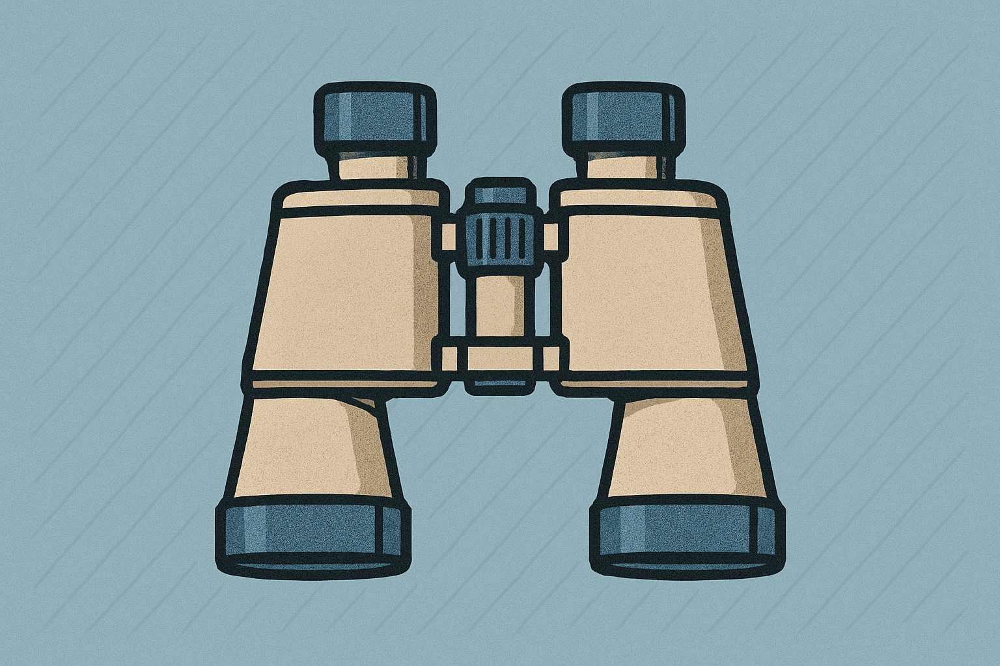
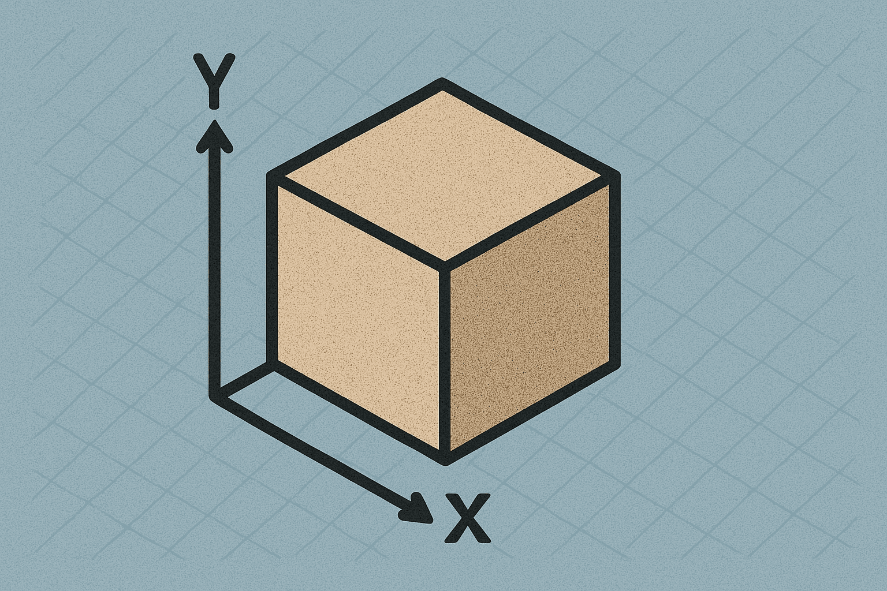
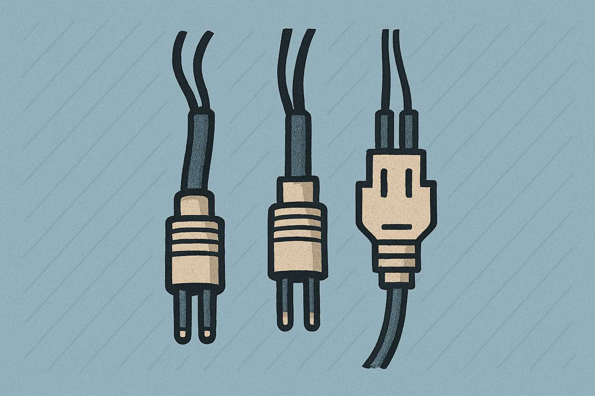
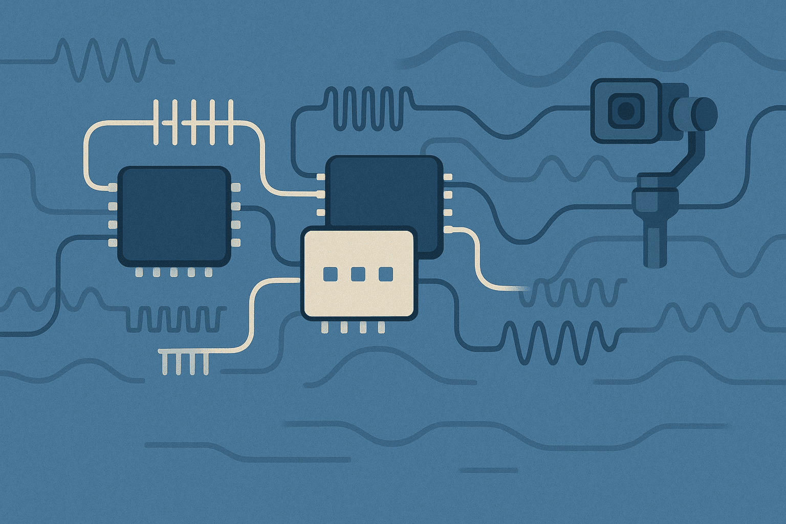
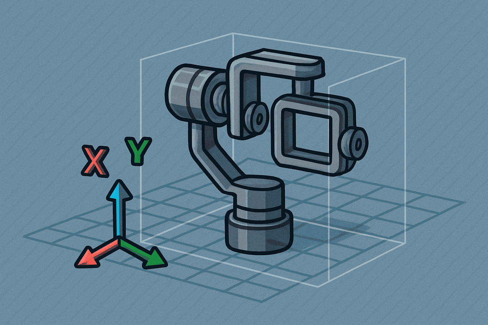
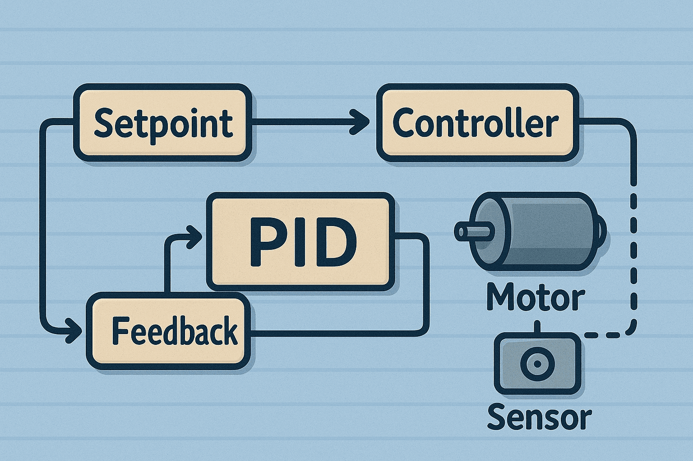

# 2 DOF Gimbal project

An in-depth engineering project exploring the development and stabilization of a 2DOF gimbal platform.

    

        <a href="Overview">
        
        
Overview
</a>
    

    

        <a href="Mechanical Design">
        
        
Mechanical Design
</a>
    

    

        <a href="Electronics">
        
        
Electronics
</a>
    

    

        <a href="Firmware">
        
        
Firmware
</a>
     

         

        <a href="Communication">
        
        
Communication
</a>
     

        

        <a href="Simulation">
        
        
Simulation
</a>
    

        

        <a href="Control System">
        
        
Control System
</a>
    

    

        <a href="Referances">
        
        
Referances
</a>
    

